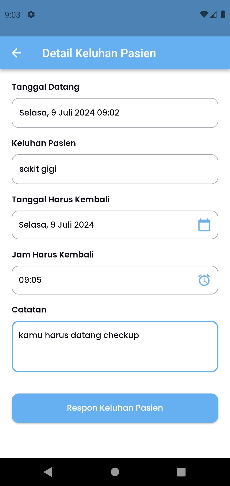
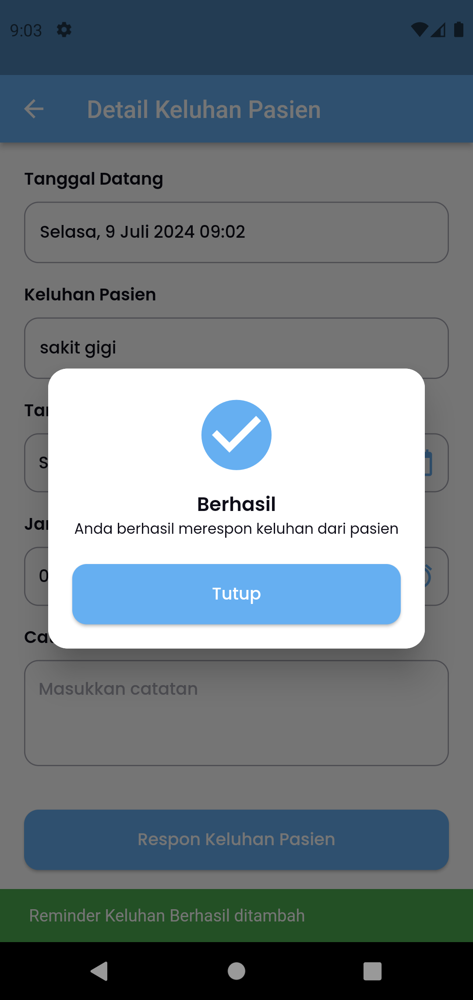

## Medical Checkup App

### Roles

- **Petugas**: 
    - Menambahkan data diri pasien yang sudah register
    - Merespon/menjawab keluhan pasien
    - Membuat jaadwal checkup dari pasien (notifikasi)
  
- **Pasien**:
    - Menginputkan keluhan yang selama ini di rasa oleh pasien
    - Mendapatkan notifikasi jika ada jadwal checkup (yang sudah di tentukan petugas)
  

**Tech Stack:**
- Firebase
- Bloc State Management
- Push Notification

**Screenshots:**

### Petugas
 | 

<!-- ### Manager Interface
Dashboard Overview | Analytics | User Management
:----------------:|:----------:|:--------------:|
 |  | 

### Employee Interface
Borrow Request | Item List | History
:-------------:|:----------:|:-------:|
 |  |  -->
