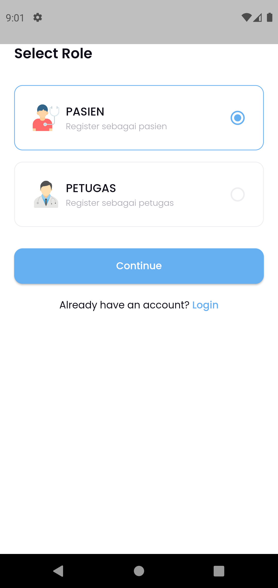
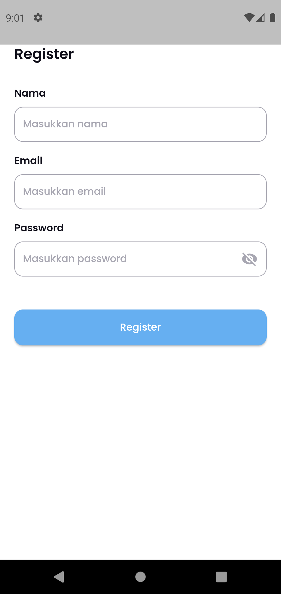
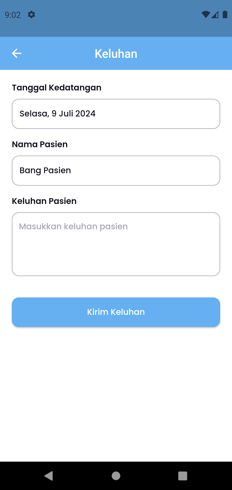
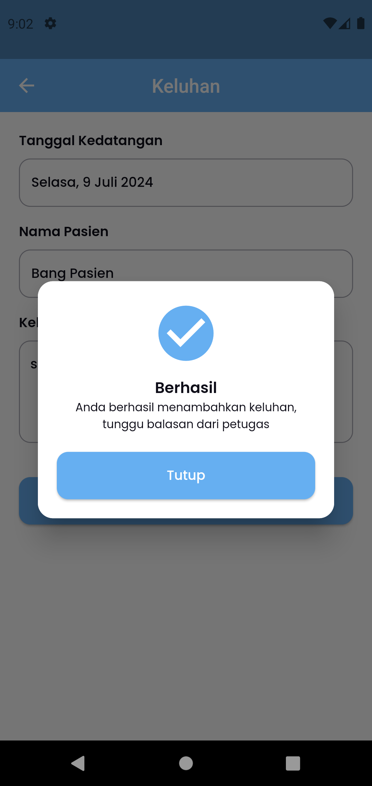
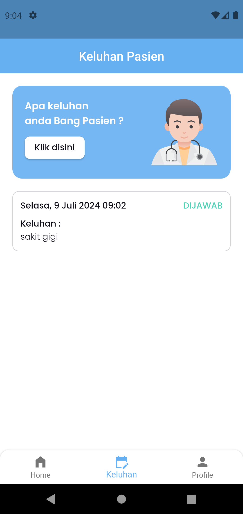
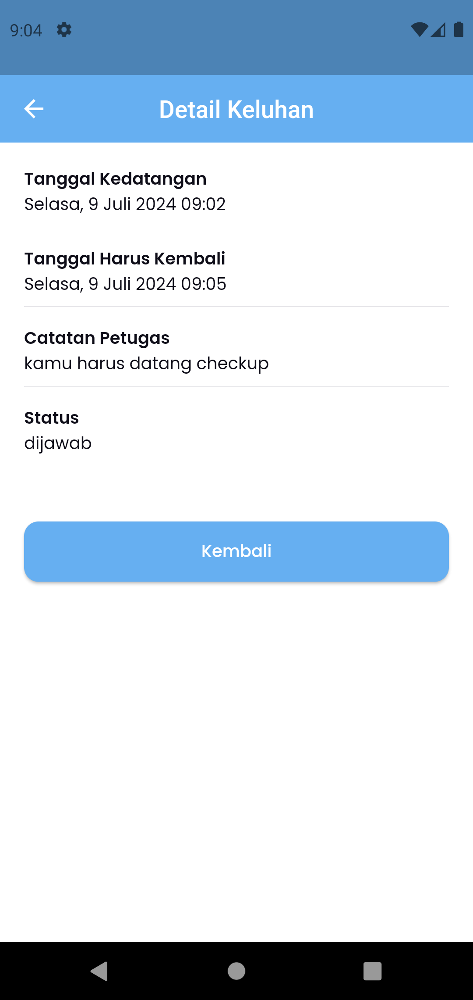
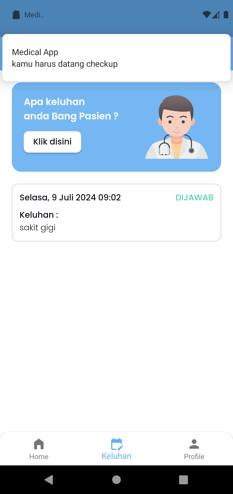
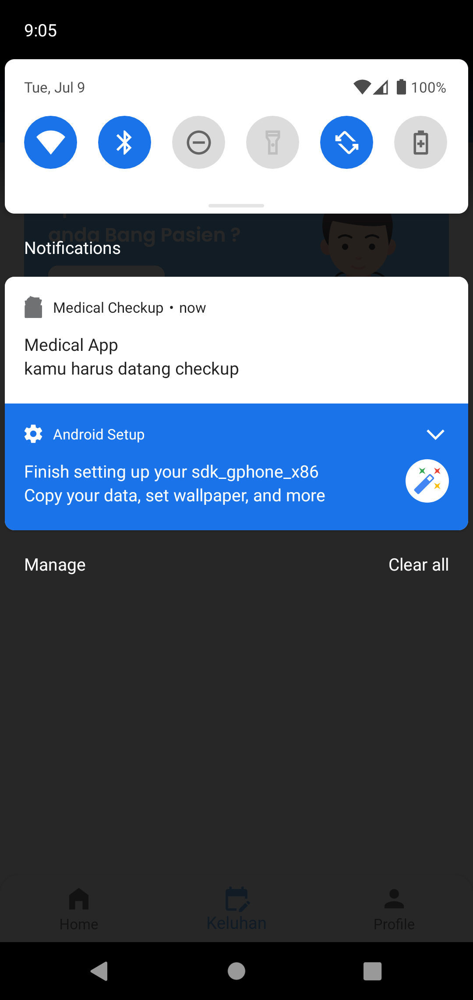

## Medical Checkup App

### Roles

- **Petugas**: 
    - Menambahkan data diri pasien yang sudah register
    - Merespon/menjawab keluhan pasien
    - Membuat jaadwal checkup dari pasien (notifikasi)
  
- **Pasien**:
    - Menginputkan keluhan yang selama ini di rasa oleh pasien
    - Mendapatkan notifikasi jika ada jadwal checkup (yang sudah di tentukan petugas)
  

**Tech Stack:**
- Firebase
- Bloc State Management
- Push Notification

**Screenshots:**

### PETUGAS
 | 

### PASIEN
 |  | 

 |  | 

 |  | 