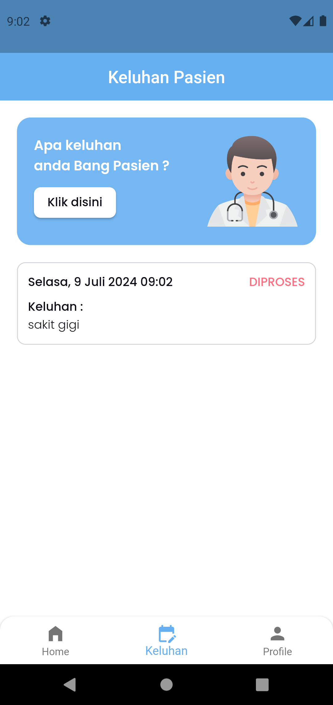
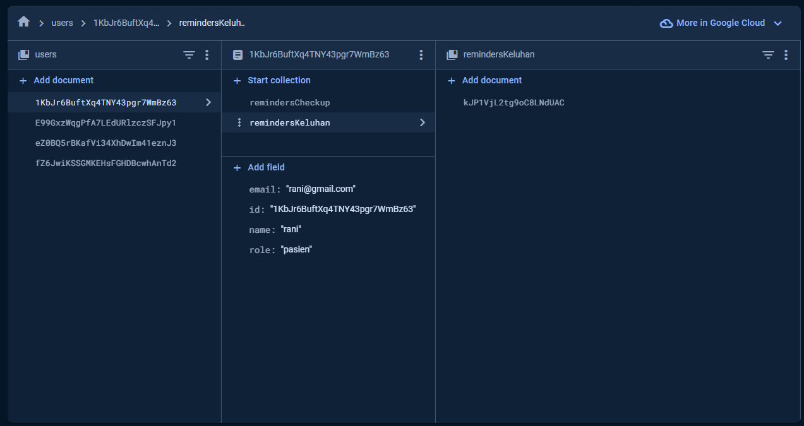

## Medical Checkup App

### Roles

- **Petugas**: 
    - Menambahkan data diri pasien (umur, tinggi badan, berat badan dll)
    - Merespon/menjawab keluhan pasien
    - Membuat jadwal checkup serta pengingat pasien (notifikasi). Contoh input tanggal dan jam checkup
  
- **Pasien**:
    - Menginputkan keluhan yang selama ini di rasa oleh pasien
    - Mendapatkan notifikasi jika ada jadwal checkup (yang sudah di tentukan petugas)
  

**Tech Stack:**
- Firebase Authentication
- Firebase Firestore Database
- Bloc State Management
- Push Notification

**Screenshots:**

### PETUGAS
 | 

 

### PASIEN
 |  | 

 |  | 

Notifikasi 1 | Notifikasi 2|
:---------:|:----------:|
 | 

 

### FIREBASE

